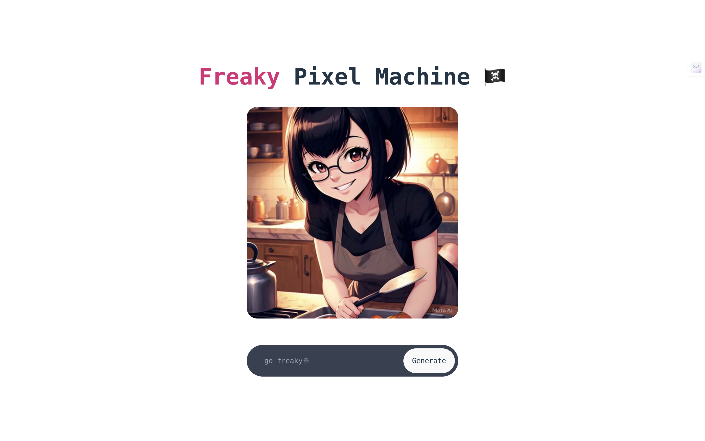
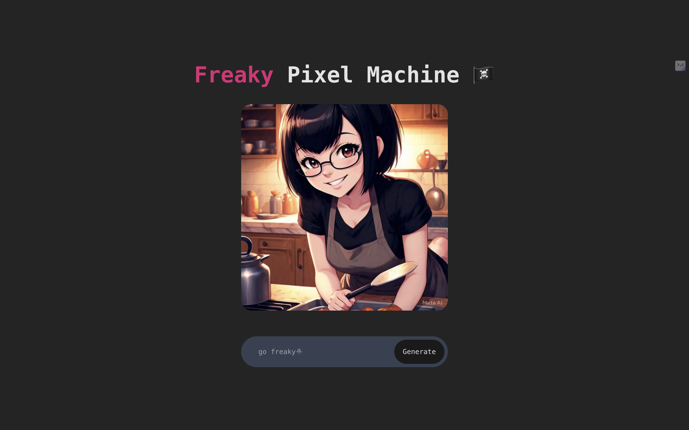

# Freaky Pixel Machine 🏴‍☠️


## Overview
**Freaky Pixel Machine🏴‍☠️** is a React-based web application that generates AI images using text prompts. Users can input a description, and the app will create multiple image variations.
This app leverages the [Text-to-Image](https://huggingface.co/spaces/Jonny001/Text-to-Image) model hosted on HuggingFace Spaces.


## Table of Contents

- [Features](#features)
- [Demo](#demo)
- [Installation](#installation)
- [Technologies Used](#technologies-used)
- [How to Use](#how-to-use)
- [Acknowledgements](#acknowledgements)
- [Project Structure](#project-structure)

## Features

- Text-to-image generation
- Multiple image output
- Responsive design
- Light/Dark mode support

## Demo

### Light Mode



### Dark Mode



**_Prompt Used_**: _nikola tesla & vincent van gogh, mafia duo, 1960s, english men, explosion in background_


## Installation

1. Clone the repository
    ```bash
    git clone https://github.com/thepushkarB/freaky-pixel-machine.git
    cd vite-imgGen
    ```

2. Install Dependencies
    Ensure you have Node.js installed. Then, run:
    ```bash
    npm install
    ```


## Run Start the Application
```
npm run dev
```
The application will be accessible at http://localhost:3000.

## Technologies Used
- React: JavaScript library for building user interfaces.
- Vite: Next-generation frontend tooling.
- Tailwind CSS: Utility-first CSS framework.
- Hugging Face Spaces: Platform for hosting machine learning models.
- Gradio Client: Interface to interact with Gradio applications.

## How to Use
1. Enter a text description
2. Click "Generate"
3. View AI-generated images


## Acknowledgements
- [Jonny001’s Text-to-Image Model](https://huggingface.co/spaces/Jonny001/Text-to-Image)
-  [Hugging Face](https://huggingface.co)
 - [Gradio](https://www.gradio.app)


## Project Structure
```
└── 📁vite-imgGen
    └── 📁public
        └── vite.svg
    └── 📁src
        └── .DS_Store
        └── App.css
        └── App.jsx
        └── 📁assets
            └── .DS_Store
            └── dark-mode-h.png
            └── dark-mode.png
            └── light-mode-h.png
            └── light-mode.png
            └── react.svg
            └── skull.png
            └── waifu.jpg
        └── index.css
        └── main.jsx
    └── .DS_Store
    └── eslint.config.js
    └── index.html
    └── package-lock.json
    └── package.json
    └── postcss.config.js
    └── README.md
    └── tailwind.config.js
    └── vite.config.js
```
